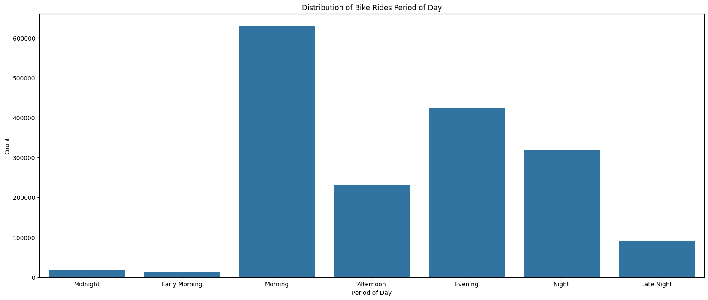
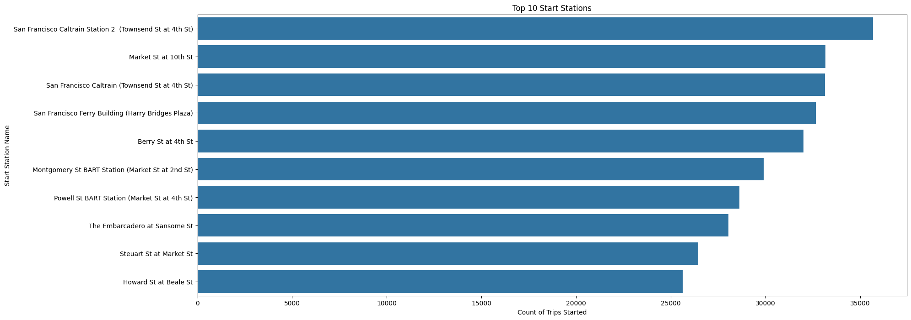
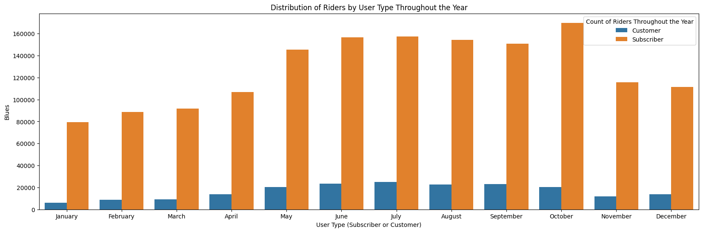
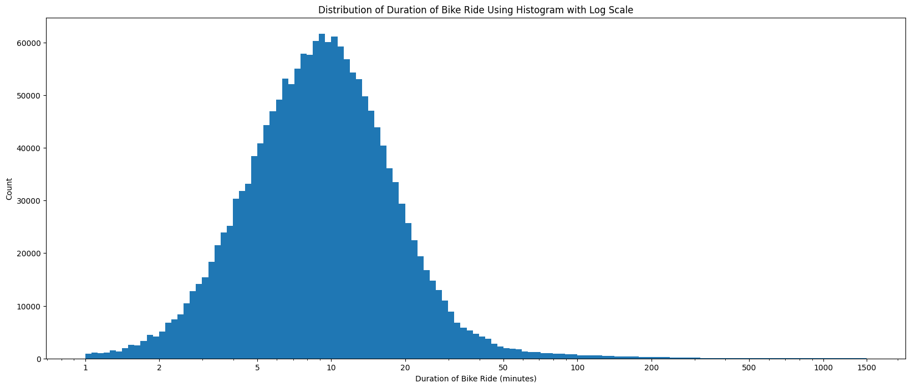
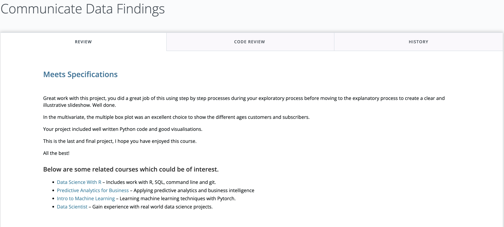
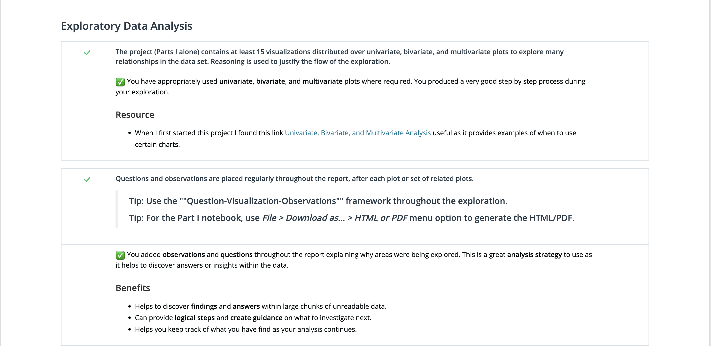
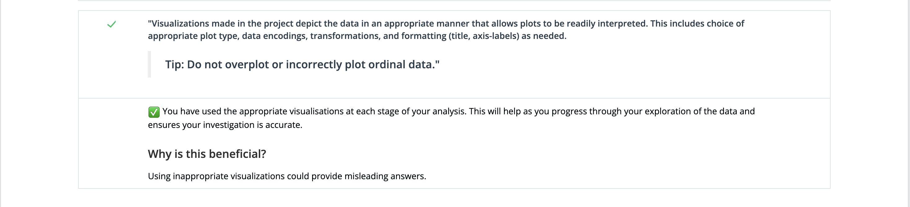
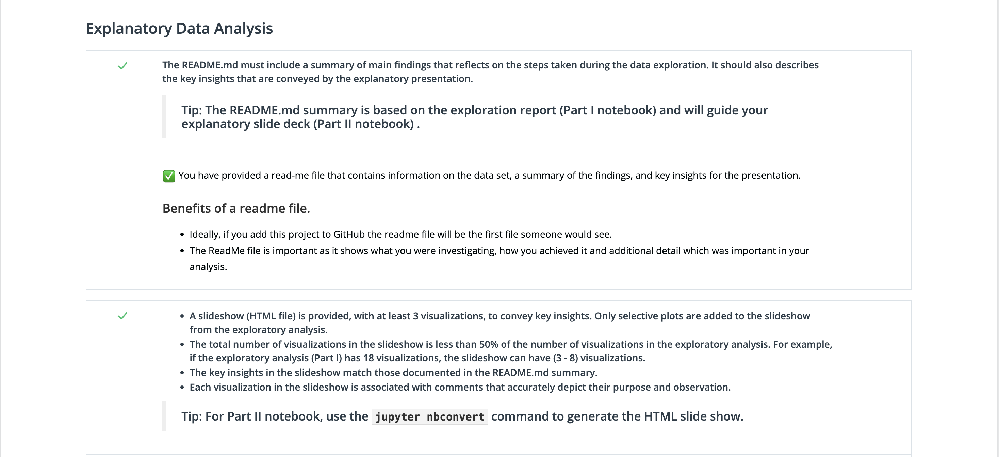
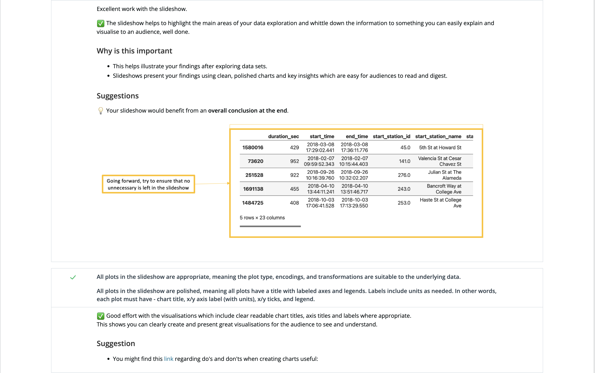

# FordBike Exploration Project

## By: Rellika Kisyula

## How to run this project

To run this project, you will need to have the following installed:

-   Python 3.7
-   Jupyter Notebook
-   Pandas
-   Numpy
-   Matplotlib
-   Seaborn
-   haversine

1. If you do not have Python 3.7 installed, you can download it from [here](https://www.python.org/downloads/).
2. You can install Jupyter Notebook by running the following command in your terminal:

```bash
pip install jupyter
```

3. You can install the other packages by running the following command in your terminal:

```bash
pip install pandas numpy matplotlib seaborn haversine
```

## Dataset

The Ford GoBike dataset contains anonymized trip data for the bike-sharing system from June 2017 to April 2019. **However, I decided to only use the data in the year 2018 (January 2018 to December 2018).** The data includes information on individual bike rides such as trip duration, start and end time, start and end station, bike ID, and user type. Additionally, demographic data such as age, gender, and membership type is provided for some users.

I manually downloaded the datasets from the [System Data | Bay Wheels | Lyft](https://www.lyft.com/bikes/bay-wheels/system-data) page. The datasets were in the form of a zip file. I extracted the zip files and saved the csv files in the `data` folder as this notebook. The zip files are in `data/zip_files` folder.

I then unzipped the files using `zipfile` and saved them in the `data/data_files` folder.

```python
# Unzip zip files in the data/zip_files folder into the data/data_files folder
import zipfile
import os

# create a list of all zip files in the zip_files folder
zip_files = os.listdir('./data/zip_files')

# loop through the list of zip files
for zip_file in zip_files:
    # create a full path to the zip file
    zip_path = './data/zip_files/' + zip_file
    # extract the zip file to the data folder
    with zipfile.ZipFile(zip_path, 'r') as zip_ref:
        zip_ref.extractall('./data/data_files')
```

I then read the csv files into a pandas dataframe and concatenated them into one dataframe. I then saved the dataframe as a csv file in the `data` folder as `bike_data.csv`.

```python
# create a list of all data files in the data_files folder
data_files = os.listdir('./data/data_files')


def read_data_files( data_files):
    '''
    Function to loop through the data files and read them into a dataframe.
    '''
    # create an empty list to store the dataframes
    dataframe_list = []
    # loop through the list of data files
    for data_file in data_files:
        # ignore if it is not a csv file
        if data_file[-3:] != 'csv':
            continue
        # create a full path to the data file
        data_path = './data/data_files/' + data_file
        # read the data file and append it to the list of dataframes
        dataframe_list.append(pd.read_csv(data_path))
    # return the list of dataframes
    return dataframe_list

# Read csv files into a pandas dataframe and concatenate them into one dataframe
dataframes = read_data_files(data_files)
# concatenate the dataframes into one dataframe
bike_data = pd.concat(dataframes, ignore_index=True)
# save the dataframe as a csv file
bike_data.to_csv('./data/bike_data.csv', index=False)
```

### Wrangling Efforts

-   I added a column for the year, month, day, hour, and day of the week to the dataframe by extracting the information from the `start_time` column.

```python
bike_data['start_time'] = pd.to_datetime(bike_data['start_time'])
# Extract the month name from the start_time column
bike_data['month_of_year'] = bike_data['start_time'].dt.strftime('%B')

# Extract the day of the week from the start_time column
bike_data['day_of_week'] = bike_data['start_time'].dt.strftime('%A')

# Extract the hour from the start_time column
bike_data['hour'] = bike_data['start_time'].dt.strftime('%H')
```

-   I calculated the distance travelled in kilometres using the `haversine` function and added it to the dataframe as `distance`.

```python
# Create a new column `distance` which is the distance between the start and end station
bike_data['distance'] = bike_data.apply(lambda x: haversine((x['start_station_latitude'], x['start_station_longitude']),
                                                                    (x['end_station_latitude'], x['end_station_longitude'])), axis=1)
```

-   I converted the `start_time` and `end_time` columns to datetime objects.

```python
# Convert the `start_time` and `end_time` to datetime type
cc_bike_data['start_time'] = pd.to_datetime(cc_bike_data['start_time'])
cc_bike_data['end_time'] = pd.to_datetime(cc_bike_data['end_time'])
```

-   I also added a column for the age of the user by subtracting the birth year from the year the data was collected (2018).

```python
# Create a new column `member_age` which is the difference between the 2018 and `member_birth_year`
bike_data['member_age'] = 2018 - bike_data.member_birth_year
# Select the column member_birth_year and member_age
bike_data[['member_birth_year', 'member_age']].sample(10)
```

I want to get the period of the day, that is either **Early Morning**, **Morning**, **Afternoon**, **Evening**, **Night**, **Late Night**, **Midnight**. I used the `start_time` column to extract the hour of the day and then categorize it into the above periods.

```python
# Using the `hour`, generate a new column `period_of_day` which is the period of the day
# Early Morning: 3am - 6am, Morning: 6am - 12pm, Afternoon: 12pm - 3pm, Evening: 3pm - 6pm, Night: 6pm - 9pm, Late Night: 9pm - 12am, Midnight: 12am - 3am
bike_data['period_of_day'] = bike_data['hour'].apply(lambda x:
'Early Morning' if 3 <= int(x) < 6
else 'Morning' if 6 <= int(x) < 12
else 'Afternoon' if 12 <= int(x) < 15
else 'Evening' if 15 <= int(x) < 18
else 'Night' if 18 <= int(x) < 21
else 'Late Night' if 21 <= int(x) < 24
else 'Midnight')
```

Finally, I saved the combined dataframe as `bike_data.csv` in the `data` folder.

```python
# Save the combined dataframe as bike_data.csv in the data folder
bike_data.to_csv('data/bike_data.csv', index=False)
```

## Summary of Findings



> In terms of time usage, bike rides were heavily used at 8 AM and 5 PM, indicating that individuals are primarily using the bike share system for commuting to and from work or school during peak morning and evening hours. I also discovered that there is a significant drop in the number of rides starting at 11:00 PM to 4:00 AM. Furthermore, the majority of rides were taken during weekdays, suggesting that the bike share system is primarily being used for weekday commuting or transportation, likely for work or school-related purposes.



> The most popular starting points for bike rides were found to be the San Francisco Ferry Building (Harry Bridges Plaza), San Francisco Caltrain Station 2 (Townsend St at 4th St), and San Francisco Caltrain (Townsend St at 4th St), which are likely transportation hubs such as train and bus stations, making them convenient and easily accessible starting points for people commuting to work or other destinations.



> An interesting observation from my analysis was that there were more subscribers than customers in the bike sharing service through out the year. This could be because the service caters more towards long-term users who can benefit from the subscription model. Additionally, the subscription model may offer discounts or other benefits, which could encourage users to sign up and contribute to the higher number of subscribers.
> 
> When looking at the duration of rides taken between January to December 2018, I found that the majority of rides lasted between 5 to 20 minutes, with a right-skewed distribution indicating that most rides were short. This trend suggests that the bike share system is primarily being used for short trips, such as commuting to and from work or school. However, riders tend to ride for longer durations on weekends, potentially using the bike share system for leisure and recreation. Interestingly, the customer category had longer ride durations throughout the week than the subscriber category, which may be because customer category riders use the bike share system more for leisure and recreation.

## Key Insights for Presentation

> For this analysis, I want to see how users utilize the bike sharing system. The main focus is on when the people ride the bikes in terms hours of the day, days of the week, and months of the year.

> For this analysis, I would like to see the most popular starting points for bike rides.

> I would also like to explore the characteristics of the users who used the bike sharing system. I would like to understand when certain categories of users (gender, user type, and age) use the bike sharing system.

> Finally I would like to analyze the duration of the rides in minutes, the distance of travel in kilometres, and what category of users use the bike sharing system the longest.

## Project Feedback







